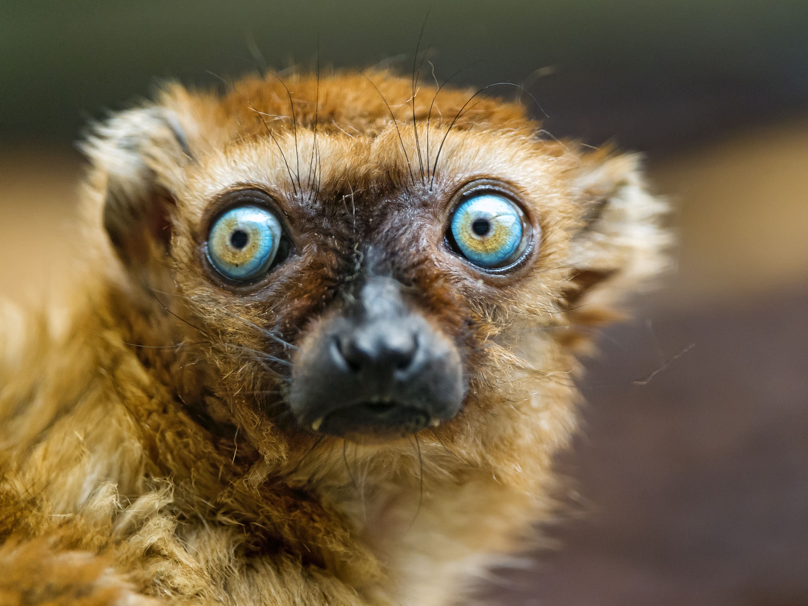
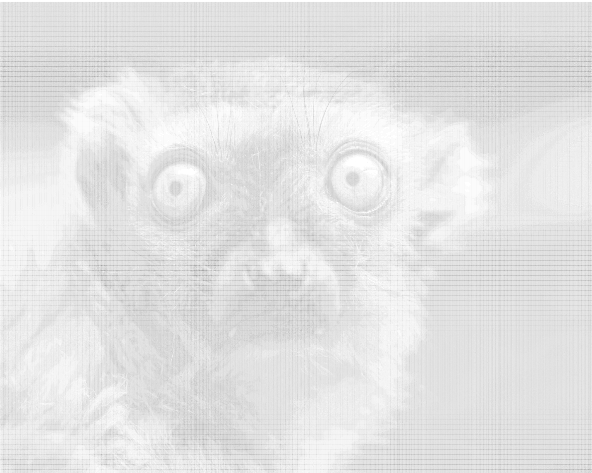
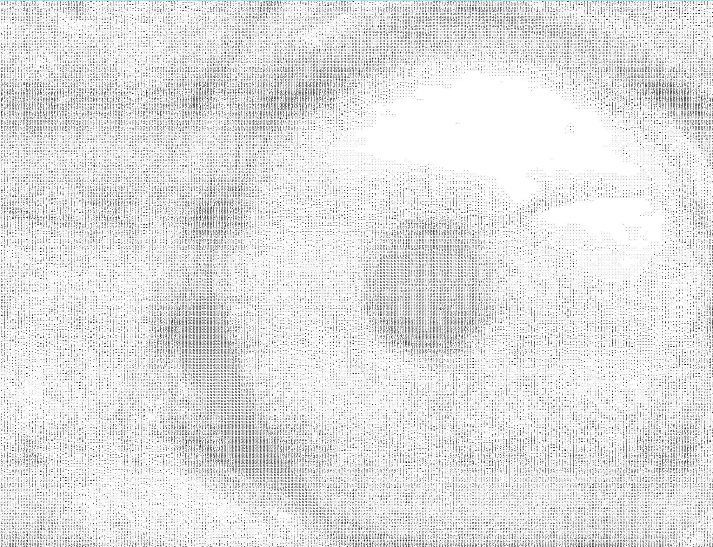

# ASCII Art Converter

A Java program that transforms pictures into ASCII characters.  
Includes an interactive shell with commands to configure resolution, character set, and output format.

  
  
  

## 📖 Usage Instructions

- **exit** → Exit the program  
- **chars** → Show the current character set  
- **add** `<a>` | `<a>-<m>` | `<m>-<a>` | `all` | `space`  
  - Add characters to the set  
  - Example: `add a`, `add a-m`, `add all`, `add space`  
- **remove** `<a>` | `<a>-<m>` | `<m>-<a>` | `all` | `space`  
  - Remove characters from the set  
  - Example: `remove m-z`  
- **res** `up` | `down` | `blank`  
  - Change the resolution of the picture  
  - `blank` shows the current resolution  
- **image** `<filename>.jpeg`  
  - Choose an input image  
- **output** `console` | `html`  
  - Select output format  
- **asciiArt**  
  - Run the algorithm with the current settings  

---

## 🧩 Classes and Roles

- **Shell**  
  Central coordinator: handles user interaction, manages output (via `AsciiOutput`), and controls image processing.  

- **AsciiArtAlgorithm**  
  Core component: converts an image into ASCII art using a given character set and resolution.  

- **SubimgCharMatcher**  
  Matches sub-images to characters. Maintains usable chars, adds/removes chars, and calculates brightness for comparisons.  

- **CharConverter**  
  Converts characters into boolean arrays (on/off pixels) for comparison with image data.  

- **Image**  
  Represents an image object, providing width, height, and methods to save/access image data.  

- **ImageUtils**  
  Utility class for padding, partitioning images, and calculating brightness.  

### Relationships
- **Shell**  
  - Uses `KeyboardInput` for commands  
  - Calls `AsciiArtAlgorithm` for conversion  
  - Selects output format (`AsciiOutput`)  
  - Handles exceptions  
  - Uses `Image` and `SubimgCharMatcher`  

- **AsciiArtAlgorithm**  
  - Uses `ImageUtils` for padding/partitioning  
  - Uses `SubimgCharMatcher` to map brightness → characters  
  - Processes the `Image`  

- **SubimgCharMatcher**  
  - Uses `CharConverter` for brightness mapping  

- **ImageUtils**  
  - Provides image utilities for padding/partitioning/brightness  

---

## ⚙️ Data Structures

### `TreeMap<Double, TreeSet<Character>> charBrightnessSortedMap`
- Maintains characters grouped by brightness (Double = brightness, TreeSet = sorted chars).  
- Advantages: efficient nearest-brightness lookup, binary search, min/max brightness.  
- **Complexity**  
  - Access: O(log N)  
  - Insert/Remove: O(log N)  
  - Memory: O(N)  

---

### `TreeSet<Character> currChars`
- Tracks the current set of allowed characters (sorted).  
- Used for fast retrieval of all usable chars for ASCII art.  
- **Complexity**  
  - Retrieval: O(1) (return entire set)  
  - Insert/Remove: O(log N)  
  - Memory: O(N)  

---

### `HashMap<Character, Double> brightnessCalcs`
- Stores brightness for each character to avoid recomputation.  
- **Complexity**  
  - Access/Insert/Remove: O(1) average  
  - Memory: O(N)  

---

## 🚨 Exceptions

Custom exception classes for clear error handling:  
- `FormatException`  
- `InvalidImagePathException`  
- `MinCharSetException`  
- `ResOutOfBoundException`  

Each is thrown in the `run` method when conditions occur, and caught with custom messages for user clarity.

---

## 🔑 Public API Additions

- `public char[] getCurrChars()`  
  Returns the current set of allowed characters, sorted.  
  - Used by the `chars` command in `Shell`.
